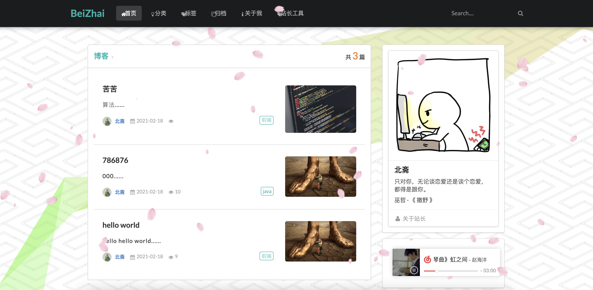

# BeiZhai

### 插件集成

[一言 hitokoto](https://hitokoto.cn/)

[百度统计](https://tongji.baidu.com/web/30949752/welcome/login)

[编辑器 Markdown](https://pandao.github.io/editor.md/)

[内容排版 typo.css](https://github.com/sofish/typo.css)

[动画 animate.css](https://daneden.github.io/animate.css/)

[代码高亮 prism](https://github.com/PrismJS/prism)

[目录生成 Tocbot](https://tscanlin.github.io/tocbot/)

[滚动侦测 waypoints](http://imakewebthings.com/waypoints/)

[平滑滚动 jquery.scrollTo](https://github.com/flesler/jquery.scrollTo)

[二维码生成 qrcode.js](https://davidshimjs.github.io/qrcodejs/)

### **技术组合**

*  后端：Spring Boot + JPA + thymeleaf模板
*  数据库：MySQL
*  前端UI：Semantic UI框架

### **🧑🏼‍💻工具与环境**

- CentOS
- 宝塔面板
- FinalShell

*  IDEA
*  Maven 3
*  MySQL5.7
*  JDK 1.8

### 👀截图

